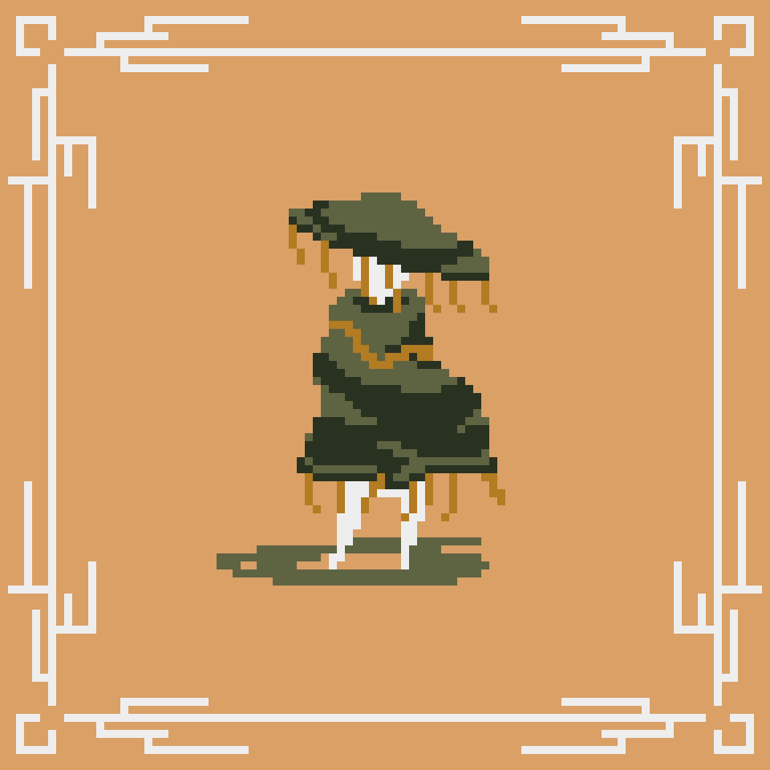

---
tags:
  - character
faction: Shuchu
share: true
---
# [Aition](Aition.md#)
> Aition, born in the [Mainland](../../../Archaina.md#) but knowledgeable in [Numentellian](../Factions/Numentellus.md#) culture, seeks to find his place in the world that has left him behind.
## About
### Background
### Motivation
## Stories
- [[../Stories/First Contact|First Contact]]
- [[../../../Sometimeworld|Sometimeworld]]
- [[../../../The One King|The One King]]
- [[../Stories/Time Was|Time Was]]

## Art

## Notes / Questions

- while the world around him is resisting the new fungal order, Aition chooses to assimilate with the newcomers and find his new place in the world. 
- Aition begins as a traveler/pirate/sailor who finds Numentellus. He gets to know the culture and society briefly.
- he learns from a young orphaned boy who he meets soon after his village is razed
	- the boy learns much about life from Aition… lessons that span cultures and societies. abstract and not bound to upbringing. 
	- Aition learns much from the boy, of the Shuchu and the islanders’ way of life
	- Since the boy has no family and is ambitious, he follows Aition to the mainland
	- just after the invasion, the boy passes away from the acts of the mainlander's xenophobic actions, his own people.
	- Aition is torn between what side is right or wrong... he travels the land in search for his place in the world. 
	- this is where his story starts
- a mainlander who wears the clothes of an invader
- he comes across Oscar in his journeys and reminds him of the young islander boy. Out of avoidance and pain, he neglects Oscar leading Oscar to seek mentorship and father-ship elsewhere.
- traits: quiet, 

- After returning to [Mainland](../../../Archaina.md#) from [Numentellus](../Factions/Numentellus.md#.md#), Aition is estranged by how different it is.
- He has expected to be welcomes with open arms with the new discoveries and technology he brought back. But most seemed disinterested with his Edge and his fungal technology. Overshadowed by the explosive new discovery, *gunpowder*.
	- New King, new politics, new weapons, new religion, and an Aition, who was left behind with the old times and a few Numentellion party tricks.